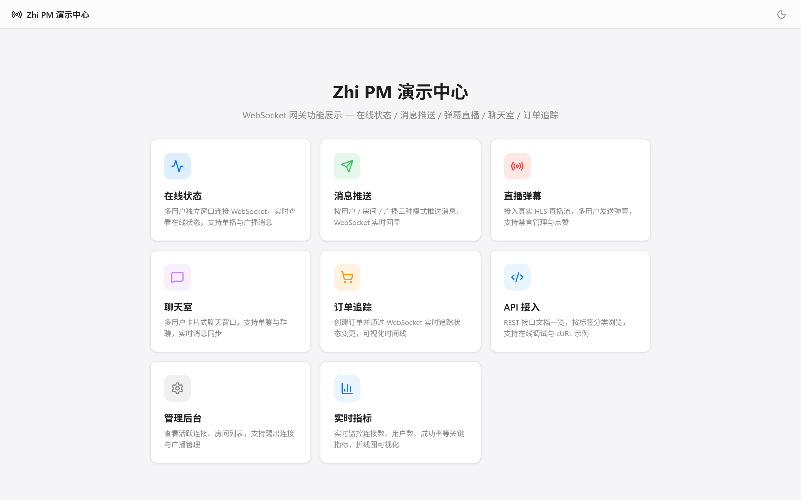
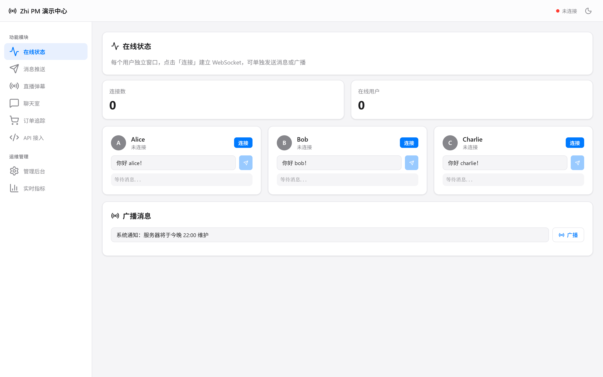
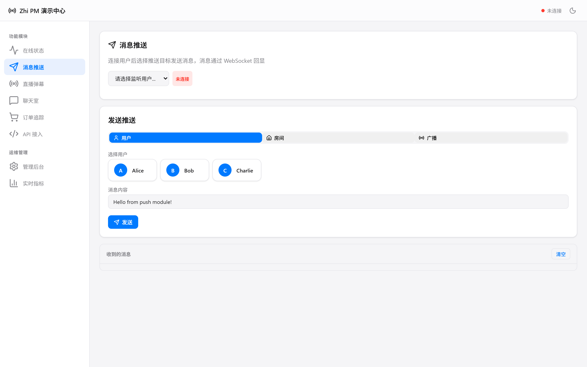
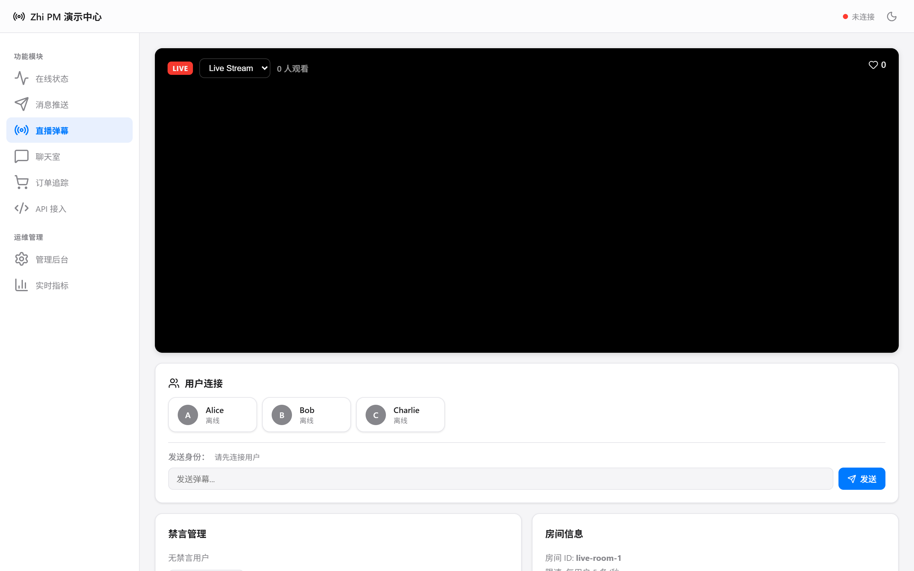
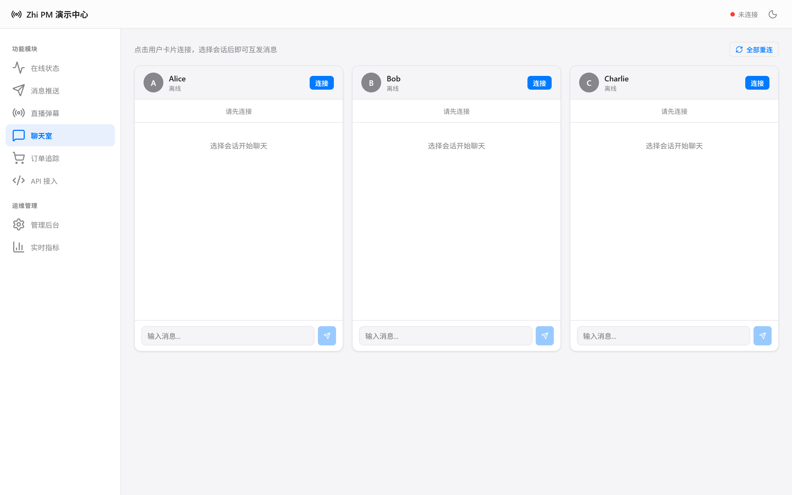
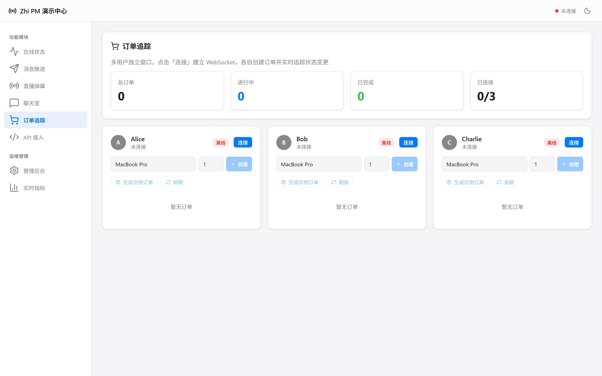
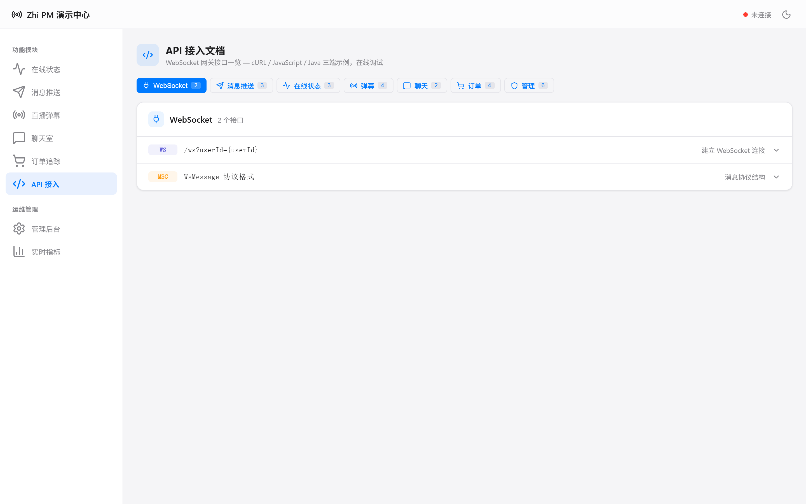
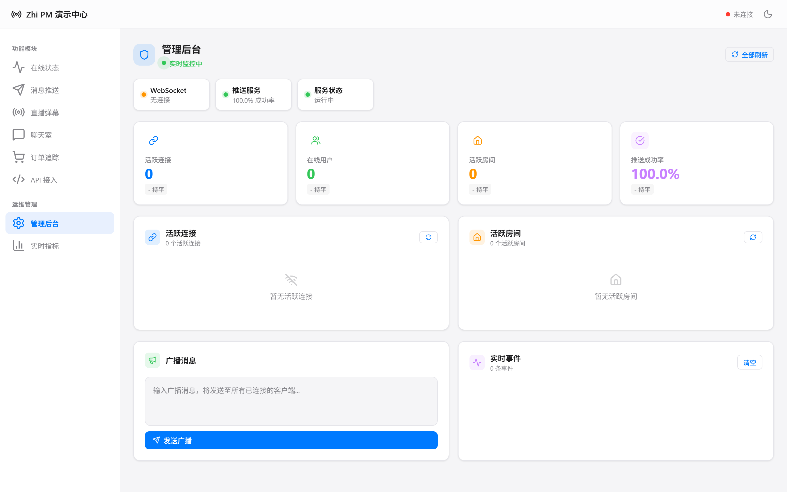
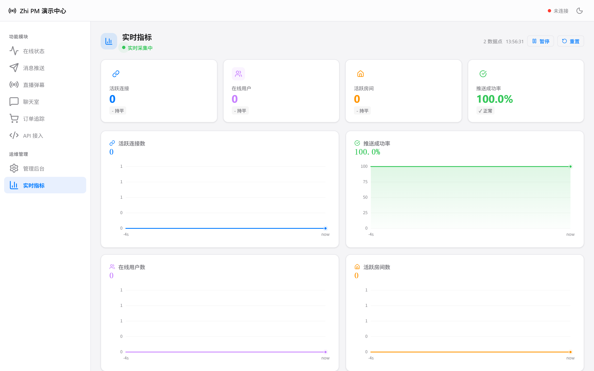

# Zhi Push Message — Production-Grade Reactive WebSocket Gateway

基于 Spring WebFlux + Reactor Netty 的响应式 WebSocket 实时消息网关，支持多实例部署、JWT 认证、消息持久化、分布式限流。

[](LICENSE)
[](https://adoptium.net/)
[](https://spring.io/projects/spring-boot)
[](https://github.com/zhi-pm/zhi-pm/releases)

---

## Introduction

Zhi Push Message (zhi-pm) 是一个开源、响应式、生产级的 WebSocket 实时消息网关。

<p align="center">
  
</p>

它不是 WebSocket Demo，而是一个面向真实生产场景的实时通信基础设施：

- **多实例部署** — Redis 连接注册表 + Pub/Sub 跨节点消息路由
- **JWT 认证** — HMAC / RSA / EC 公钥验证，对接外部认证服务
- **消息持久化** — 聊天消息落盘、离线消息补偿、At-Least-Once 投递
- **分布式限流** — Redis Lua 滑动窗口，跨实例统一限流
- **全链路非阻塞** — 接口层全 reactive（Mono/Flux），零 `.block()` 调用
- **零配置兼容** — `@ConditionalOnClass` + `@ConditionalOnMissingBean`，不加配置 = 旧版行为

覆盖场景：企业实时通知、在线状态、单聊/群聊、房间广播、直播间弹幕、订单状态推送、Prometheus/Grafana 可观测。

---

## Features

### 核心能力

| 能力 | 说明 |
|------|------|
| **响应式架构** | Spring WebFlux + Reactor Netty，全链路非阻塞 |
| **连接管理** | InMemory / Redis 双实现，多端连接，Session Lease 自动过期 |
| **用户推送** | 单用户、多用户、全站广播，跨实例路由 |
| **房间广播** | 房间加入/退出、成员管理、在线人数统计 |
| **直播弹幕** | 高吞吐弹幕、本地/分布式限流、敏感词过滤、禁言 |
| **聊天室** | 单聊/群聊、消息 ACK、离线补偿、未读数、历史消息 |
| **JWT 认证** | HMAC (HS256/384/512) + RSA/EC 公钥，可配置 Claims 提取 |
| **多实例分发** | Redis Pub/Sub 低延迟广播、Kafka 可靠消息 |
| **管理控制台** | 实时 Dashboard、连接管理、消息追踪 |
| **可观测性** | Micrometer 指标、Prometheus 端点、Grafana Dashboard |

### v1.0.0 生产级增强

| 特性 | 实现 |
|------|------|
| **Redis 连接注册** | `zhi-pm-registry-redis` 模块，Hash/Set 存储连接元数据，TTL Session Lease |
| **跨节点推送** | `ClusterAwareMessageSender` — 本地投递 + Broker 广播双通道 |
| **消息持久化** | `ChatStorage` 接口 + `RedisChatStorage`，LPUSH + LTRIM 保留历史 |
| **离线消息队列** | 用户离线时消息入队，重连后自动 Drain |
| **JWT 认证** | `JwtWebSocketAuthenticator`，支持 JWKS、Issuer/Audience 验证 |
| **分布式限流** | `RedisRateLimiter`，Lua 脚本 ZADD + ZREMRANGEBYSCORE 滑动窗口 |
| **全接口 Reactive** | `ChatStorage`/`RateLimiter` 返回 `Mono<>`/`Flux<>`，无阻塞调用 |

### Showcase

| 在线状态 | 消息推送 | 直播弹幕 |
|:--------:|:--------:|:--------:|
|  |  |  |

| 聊天室 | 订单追踪 | API 接入 |
|:------:|:--------:|:--------:|
|  |  |  |

| 管理后台 | 实时指标 |
|:--------:|:--------:|
|  |  |

---

## Architecture

```
┌─────────────────────────────────────────────────────────────┐
│                      Client Layer                           │
│  Browser / Mobile / Desktop / CLI                           │
└─────────────────────────┬───────────────────────────────────┘
                          │ WebSocket (JWT / Token Auth)
┌─────────────────────────▼───────────────────────────────────┐
│                  zhi-pm-server  ×N                           │
│  ┌─────────────────────────────────────────────────────┐   │
│  │  GatewayWebSocketHandler                            │   │
│  │  Auth ──► Decode ──► Route ──► Encode ──► Send      │   │
│  └─────────────────────────────────────────────────────┘   │
│  ┌──────────────┐  ┌──────────────┐  ┌──────────────┐     │
│  │  Connection   │  │   Cluster    │  │   Heartbeat  │     │
│  │  Registry     │  │   Sender     │  │   Service    │     │
│  │ (Redis/Local) │  │ (Local+Broker│  │              │     │
│  └──────────────┘  └──────────────┘  └──────────────┘     │
└──────┬──────────────────────┬───────────────────────────────┘
       │                      │
┌──────▼──────────────────────▼──────────────────────────────┐
│                   Redis Cluster                             │
│  ┌──────────────┐  ┌──────────────┐  ┌──────────────┐     │
│  │  Connection   │  │  Pub/Sub     │  │  Chat        │     │
│  │  Registry     │  │  Broker      │  │  Storage     │     │
│  │  (Hash/Set)   │  │              │  │  (List/Hash) │     │
│  └──────────────┘  └──────────────┘  └──────────────┘     │
│  ┌──────────────┐  ┌──────────────┐                        │
│  │  Rate Limiter │  │  Offline     │                        │
│  │  (Lua Script) │  │  Queue       │                        │
│  └──────────────┘  └──────────────┘                        │
└─────────────────────────────────────────────────────────────┘
       │
┌──────▼──────────────────────────────────────────────────────┐
│                   Feature Modules                           │
│  ┌────────┐  ┌─────────┐  ┌────────┐  ┌──────────────┐    │
│  │  Room  │  │ Danmaku │  │  Chat  │  │ Observability │    │
│  └────────┘  └─────────┘  └────────┘  └──────────────┘    │
└─────────────────────────────────────────────────────────────┘
```

---

## Quick Start

### Prerequisites

- Java 21+
- Maven 3.9+
- Redis (optional，多实例/持久化/分布式限流)
- Kafka (optional，可靠消息模式)

### 方式一：Maven 直接运行

```bash
git clone https://github.com/zhi-pm/zhi-pm.git
cd zhi-pm
mvn clean package -DskipTests
java -jar samples/basic/sample-basic-echo/target/sample-basic-echo-*.jar
```

WebSocket 服务运行在 `ws://localhost:8080/ws`

### 方式二：Docker Compose

```bash
# Redis + Gateway
docker compose up -d

# Redis + Kafka + Gateway
docker compose -f docker-compose.yml -f docker-compose.kafka.yml up -d
```

### 测试连接

```bash
# WebSocket 连接
websocat "ws://localhost:8080/ws?access_token=alice-token"

# 心跳
{"type":"heartbeat.ping","timestamp":1710000000000}

# REST API 推送
curl -X POST http://localhost:8080/api/push/user/alice \
  -H "Content-Type: application/json" \
  -d '{"type":"notification","payload":{"title":"Hello","content":"World"}}'
```

---

## Module List

### 核心模块

| 模块 | 说明 |
|------|------|
| `zhi-pm-core` | 核心协议、连接管理、消息路由、JWT 认证、发送抽象 |
| `zhi-pm-spring-boot-autoconfigure` | 自动配置、配置属性、默认 Bean |
| `zhi-pm-spring-boot-starter` | Starter 依赖聚合 |
| `zhi-pm-server` | 独立部署的 Push Message 网关服务 |

### 功能模块

| 模块 | 说明 |
|------|------|
| `zhi-pm-room` | 房间加入、退出、广播、人数统计 |
| `zhi-pm-danmaku` | 弹幕、本地/分布式限流、过滤、禁言 |
| `zhi-pm-chat` | 单聊、群聊、ACK、历史消息、离线补偿、Redis 持久化 |

### 集成模块

| 模块 | 说明 |
|------|------|
| `zhi-pm-registry-redis` | Redis 连接注册表，多实例连接状态共享 |
| `zhi-pm-broker-redis` | Redis Pub/Sub 多实例分发 |
| `zhi-pm-broker-kafka` | Kafka 可靠消息分发 |
| `zhi-pm-observability` | Micrometer 指标、Prometheus 端点 |
| `zhi-pm-admin-api` | 管理接口 |
| `zhi-pm-admin-ui` | 管理页面 |

---

## Configuration Reference

### WebSocket 配置

```yaml
realtime:
  websocket:
    path: /ws
    outbound-buffer-size: 256
    max-frame-payload-length: 65536

    auth:
      enabled: true
      token-param-name: access_token
      header-name: Authorization

      # Demo 模式（开发测试）
      demo-tokens:
        alice-token: alice
        bob-token: bob

      # JWT 模式（生产推荐）
      type: jwt
      jwt:
        secret: "your-hmac-secret"           # HMAC 密钥
        # public-key: "MIIBIjANBg..."        # RSA 公钥 (PEM)
        issuer: "https://auth.example.com"
        audience: "zhi-pm"
        user-id-claim: "sub"                 # 提取 userId 的 claim

    heartbeat:
      enabled: true
      client-timeout: 60s
      check-interval: 30s
```

### 连接注册表（多实例）

```yaml
realtime:
  registry:
    type: redis                # memory (默认) | redis
    session-lease-seconds: 120 # Session TTL，心跳续期
    redis-key-prefix: realtime
```

### 聊天存储

```yaml
realtime:
  chat:
    enabled: true
    storage-type: redis        # memory (默认) | redis
    redis-key-prefix: realtime
    offline-message-enabled: true
    max-history-per-conversation: 200
    max-message-length: 2000
```

### 弹幕限流

```yaml
realtime:
  danmaku:
    enabled: true
    limiter-type: redis        # local (默认) | redis
    redis-key-prefix: realtime
    max-content-length: 100
    max-message-per-user-per-second: 2
    max-message-per-room-per-second: 5000
    sensitive-words:
      - spam
      - ads
```

### Broker 配置

```yaml
realtime:
  broker:
    type: redis                # redis | kafka
    redis:
      topic: realtime:ws:message
    kafka:
      topic: realtime-ws-message
      consumer-group: realtime-ws-gateway
```

---

## Samples

### Basic Samples

| 示例 | 端口 | 说明 |
|------|------|------|
| `sample-basic-echo` | 8080 | 最小 WebSocket 连接，Echo + Token + 心跳 |
| `sample-presence` | 8081 | 在线状态、心跳、多端连接、房间管理 |

### Business Samples

| 示例 | 端口 | 说明 |
|------|------|------|
| `sample-notification-center` | 8082 | 企业通知、用户推送、未读数 |
| `sample-live-danmaku` | 8083 | 房间弹幕、限流、敏感词过滤 |
| `sample-chat-room` | 8084 | 单聊、群聊、ACK、历史消息 |
| `sample-order-tracking` | 8086 | Kafka 订阅、订单状态推送 |

### Operations Samples

| 示例 | 端口 | 说明 |
|------|------|------|
| `sample-admin-console` | 8085 | 实时监控、连接治理、Prometheus 指标 |

---

## Message Protocol

```json
{
  "id": "msg_123456",
  "type": "chat.group.message",
  "traceId": "trace_abc",
  "timestamp": 1710000000000,
  "payload": { "content": "hello" }
}
```

| 字段 | 类型 | 说明 |
|------|------|------|
| `id` | string | 服务端消息 ID |
| `clientMessageId` | string | 客户端消息 ID，用于幂等 |
| `type` | string | 消息类型 |
| `traceId` | string | 链路追踪 ID |
| `from` | string | 发送者 |
| `to` | string | 接收者 |
| `roomId` | string | 房间 ID |
| `timestamp` | long | 时间戳（毫秒） |
| `payload` | object | 业务负载 |

### 内置消息类型

| 类型 | 说明 |
|------|------|
| `heartbeat.ping` / `heartbeat.pong` | 心跳 |
| `echo` | Echo 回显 |
| `room.join` / `room.leave` / `room.broadcast` | 房间 |
| `danmaku.send` / `danmaku.message` | 弹幕 |
| `chat.send` / `chat.message` / `chat.ack` | 聊天 |

---

## Admin API

```bash
# 连接管理
GET    /admin/api/connections
GET    /admin/api/connections/{sessionId}
DELETE /admin/api/connections/{sessionId}

# 房间管理
GET    /admin/api/rooms
GET    /admin/api/rooms/{roomId}/members
GET    /admin/api/rooms/{roomId}/count

# 用户管理
GET    /admin/api/users/{userId}/online
POST   /admin/api/push/user/{userId}

# 广播
POST   /admin/api/push/broadcast

# 统计
GET    /admin/api/stats
```

---

## Metrics

Prometheus 端点：`http://localhost:8080/actuator/prometheus`

| 指标 | 类型 | 说明 |
|------|------|------|
| `ws.connections.active` | Gauge | 当前活跃连接数 |
| `ws.users.online` | Gauge | 在线用户数 |
| `ws.rooms.active` | Gauge | 活跃房间数 |
| `ws.messages.inbound.total` | Counter | 入站消息总数 |
| `ws.messages.outbound.total` | Counter | 出站消息总数 |
| `ws.danmaku.inbound.total` | Counter | 弹幕入站总数 |
| `ws.danmaku.limited.total` | Counter | 弹幕限流总数 |
| `ws.chat.messages.total` | Counter | 聊天消息总数 |
| `ws.broker.publish.latency` | Timer | Broker 发布延迟 |

Grafana Dashboard：`docs/grafana/zhi-pm-dashboard.json`

---

## Docker Compose

```yaml
version: "3.8"
services:
  redis:
    image: redis:7-alpine
    ports: ["6379:6379"]
    volumes: [redis-data:/data]

  gateway:
    build: .
    ports: ["8080:8080"]
    depends_on: [redis]
    environment:
      - SPRING_DATA_REDIS_HOST=redis
      - REALTIME_BROKER_TYPE=redis
      - REALTIME_WEBSOCKET_AUTH_TYPE=jwt
      - REALTIME_WEBSOCKET_AUTH_JWT_SECRET=your-secret

volumes:
  redis-data:
```

---

## JDK 8 集成

独立部署 `zhi-pm-server`，JDK 8 业务系统通过 HTTP API 推送：

```bash
curl -X POST http://gateway:8080/api/push/user/{userId} \
  -H "Content-Type: application/json" \
  -d '{"type":"order.status","payload":{"orderId":"12345","status":"SHIPPED"}}'
```

---

## Contributing

1. Fork 项目
2. 创建功能分支 (`git checkout -b feature/amazing-feature`)
3. 提交更改 (`git commit -m 'Add amazing feature'`)
4. 推送到分支 (`git push origin feature/amazing-feature`)
5. 创建 Pull Request

```bash
git clone https://github.com/zhi-pm/zhi-pm.git
cd zhi-pm
mvn clean compile   # 编译
mvn test            # 测试
```

---

## Roadmap

### v1.0.0 Production Ready (当前版本)

- 核心 WebSocket 网关 + 连接管理 + 用户推送
- 房间广播 + 在线人数统计
- 直播弹幕 + 限流 + 敏感词过滤
- 单聊/群聊 + ACK + 离线补偿
- 管理控制台 + Prometheus 指标
- Kafka 可靠消息
- **Redis 连接注册表** — 多实例连接状态共享
- **JWT 认证** — HMAC / RSA / EC
- **消息持久化** — Redis 存储 + 离线消息队列
- **分布式限流** — Redis Lua 滑动窗口
- Docker Compose + Helm Chart

---

## License

MIT License — 详见 [LICENSE](LICENSE)

---

## Acknowledgments

- [Spring WebFlux](https://docs.spring.io/spring-framework/reference/web/webflux-websocket.html)
- [Reactor Netty](https://projectreactor.io/docs/netty/release/reference/)
- [Redis](https://redis.io/)
- [Apache Kafka](https://kafka.apache.org/)
- [JJWT](https://github.com/jwtk/jjwt)
- [Micrometer](https://micrometer.io/)
- [Prometheus](https://prometheus.io/)
- [Grafana](https://grafana.com/)
